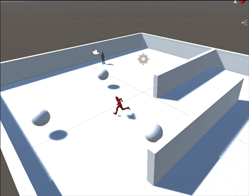

# Basic AI

This is the recreation of the Basic AI project from the good folks of Renaissance Coders over 
[on Youtube](https://www.youtube.com/watch?v=s67AYDD3j1E&index=3&list=PL4CCSwmU04Mh8GHV702HxgfRpYmgTwq2l).
It was created with Unity 2017.2.0f3.

*gif is not identical to the scene in this project*

# Step By Step

- import characters from standard assets (menu assets/import package/characters). If you don't see the package you need to re-run the installer.

- create a plane
(menu game object/3d object/plane)

- scale the plane to 3,0.1,3

- set the plane to 'navigation static' in the upper right corner of the inspector

- reveal the navigation menu
(menu Window/Navigation)

- save the scene

- in the new navigation tab in the inspector, go to bake and then press the bake button

- go to project/assets/standard assets/characters/ThirdPersonCharacter/Prefabs

- drop a ThirdPersonController onto the plane

- set the tag to 'player'

- position the main camera behind it

- drag and drop the main camera into ThirdPersonController/EthanSkeleton

you should be able to run around with Ethan now

- create a sphere
- rename it to sphere0
- check isTrigger in the sphere collider

- duplicate it and move the copy elsewhere
- rename the copy to sphere1

- drop an AIThirdPersonController onto the plane

- remove the 'AI Character Control' component

- create a folder named 'scripts'

- create a C# script in it called basicAI

- drop this text into the script 

- add basicAI component to AI

- set waypoints to 2
- add spheres as Element 0 and Element 1

the AI should now walk to sphere0 and 1 and back

- add component physics/sphere collider

- check isTrigger

- set radius to 5 (or whatever)

Once the player approaches the AI, it should start to chase him.

